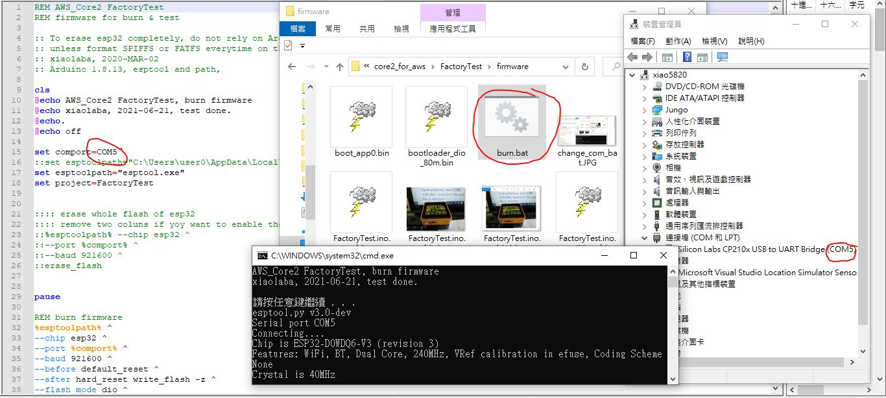
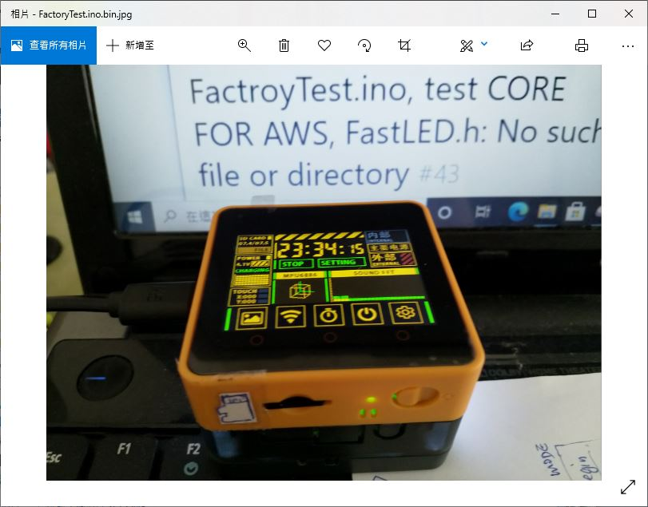

# ESP32 AWS IoT EduKit FactoryTest
AWS core 2, to burn the testing firmware, no need to compile, no other software is required.  

esptool.exe is enclosed for convenience, distributed by 樂鑫 & Arduino IDE, it is possible python compiled exe (3MB szie). esptool.exe is only support ESP8266 for make_image, not capable with ESP32, so ESP32 has no solution to release a single image file for flash burning, need each section image for flashing a single device. The better practices, easer whole chip everytime if you like.

### how to, image for COM port finding & to change with burn.bat  
  

### how to
```
fork this repo or download the zip,   

go to sub-folder /ESP32_AWS_IoT_EduKit_FactoryTest/tree/main/core2_for_aws/FactoryTest/firmware  

connect AWS kit to PC USB, find yourself with COM port number,  

open burn.bat, change COM5 to match yours, save file.  

ensure to close all other app whether it is possible using the COM port at the moment.  

double click on burn.bat  

job should be done.  
```


### result,  
  


It is not so easy for newbie to  deal with AWS core2 or the ESP32 IDF. I have not be able use PlatformIO to build the Factory firmware, but IDF 4.2 was ok, did not know why, looking for help, https://github.com/m5stack/Core2-for-AWS-IoT-EduKit/issues/63   


To make this simple and fast, try other firmware or testing, all code and tools are available and released by Espressife or M5,

no fork, but clone the project for own purpose, https://github.com/m5stack/M5Core2/tree/master/examples/core2_for_aws


### In case want to compile the code by youself, do things following,

```
/*
 * install FastLED, https://github.com/FastLED/FastLED/issues/373, WS2812 and SK6812 (of CORE2 FOR AWS) are equlivent  
 * install M5Core2, https://github.com/m5stack/M5Core2  
 * via Arduino Library manager, will do.  
 * 2021-06-21, test ok, xiaolaba  
 */
```


### In case need firmware alone and test,  
here is everything would be need, just connect AWS Core2 or m5stank Core2 to PC, run burn.bat, it should work.  
under win10, a batch file will do the job, easier for all beginner.  
[core2_for_aws/FactoryTest/firmware](core2_for_aws/FactoryTest/firmware)    


